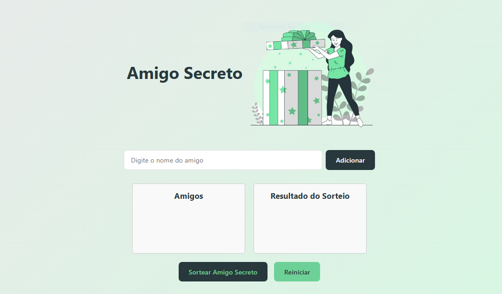

# 🎁 Sistema de Sorteio de Amigo Secreto - Refatorado

Este projeto é um sistema de sorteio de amigo secreto desenvolvido durante o desafio do curso "Praticando Lógica de Programação" da Alura, na Formação ONE. A aplicação permite organizar sorteios de forma simples, prática e divertida, utilizando JavaScript para a lógica e interação com o usuário.

## Preview do Projeto

## 🚀 Funcionalidades
- ✅ Adicionar participantes: Insira os nomes dos amigos que participarão do sorteio.
- ✅ Validações: Impede a adição de nomes vazios ou duplicados.
- ✅ Exibição da lista: Mostra todos os participantes adicionados.
- ✅ Sorteio aleatório: Realiza o sorteio de forma justa e aleatória.
- ✅ Exibição do resultado: Apresenta os pares sorteados de forma clara.
- ✅ Reiniciar sorteio: Permite limpar a lista e começar um novo sorteio.

## 🛠️ Tecnologias Utilizadas
- HTML: Estrutura da página.
- CSS: Estilização e design responsivo.
- JavaScript: Lógica de programação e interação com o usuário.

## 💬 Feedback
Sinta-se à vontade para abrir uma issue no repositório ou entrar em contato comigo para sugestões, críticas ou dúvidas.😊
